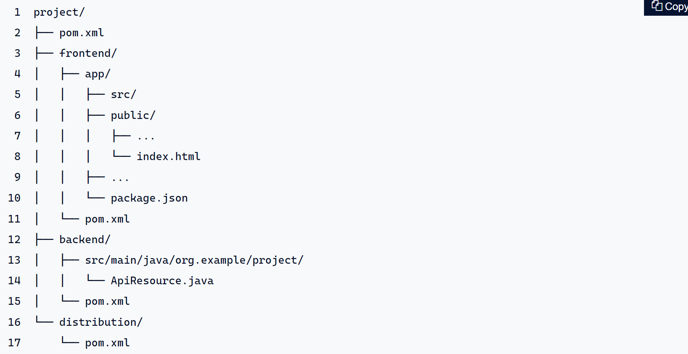

# <p align="center">🌎 Planet Earth</p> 


Functional sample project based on [Mars3D](http://mars3d.cn) and [Quarkus](https://quarkus.io/). A system that displays a single page for each individual function and supports the modification and editing of code for real-time operation. 
It is mainly used for developers to learn and understand the use of each function of Mars3D, and for business personnel to understand and experience the function points of Mars3D. 

First of all, it is recommended that you study and browse the source code of our functional examples (there will be a lot of comments in the source code). When reading the source code, you can combine it with the API documentation to understand the functions and parameter descriptions of classes and methods. 


## Project Introduction 
 
This is a function sample demonstration project developed based on `native JS`. 


## Project features 
- **Independent page**: Each page is a separate example with few dependencies and runs independently. 
- **Suitable for different technology stacks**: Native JS development, suitable for users of different technology stacks to understand 


## Download and run the project 

### 1. Requirements

To compile and run this demo you will need:
- Docker
- Node
- JDK 17+
- GraalVM (for native image)

Configuring GraalVM and JDK 17+ (for native image)
 - Make sure that both the `GRAALVM_HOME` and `JAVA_HOME` environment variables have been set, and that a JDK 11+ `java` command is on the path.

 - See the [Building a Native Executable guide](https://quarkus.io/guides/building-native-image-guide) for help setting up your environment.

### 2. Download code
Download source code from git repository 

``` 
git clone git@github.com:antus/planet-earth.git 
``` 

- If there is no git software locally, you can enter [https://github.com/antus/planet-earth](https://github.com/antus/planet-earth) address  in the browser and download the zip package as shown below. 

### 3. Run docker compose
``` 
cd scripts
docker-compose up -d

To stop/remove docker containers
docker-compose down
```  

go to localhost:8180 and login as admin/admin

### 4. Development & Debug

#### Start the backend
``` 
cd backend
``` 
Start backend in the development mode with live reload
``` 
mvn quarkus:dev 
``` 
#### Start the frontend
``` 
cd frontend/app
```
For the first time, install dependencies
```
npm install 
```
Start frontend in the development mode with live reload 
```
npm run start
```
Navigate to:

<http://localhost:3000>

Have fun, and join the team of contributors! 


### 5. Testing
You can all the tests via the command ```mvn clean verify``` (and you will notice that the two tests are ran at different times).

It will generate three separate reports:
* a consolidated report that will show the coverage of all your tests combined in  ```target/jacoco-report```

### 6. Code quality

Sonar is used to analyse code quality. You can start a local Sonar server (accessible on http://localhost:9001) with:

```
docker-compose -f src/main/docker/sonar.yml up -d
```

Note: we have turned off authentication in [src/main/docker/sonar.yml](src/main/docker/sonar.yml) for out of the box experience while trying out SonarQube, for real use cases turn it back on.

You can run a Sonar analysis with using the [sonar-scanner](https://docs.sonarqube.org/display/SCAN/Analyzing+with+SonarQube+Scanner) or by using the maven plugin.

Then, run a Sonar analysis:

```
./mvnw clean verify sonar:sonar
```

If you need to re-run the Sonar phase, please be sure to specify at least the `initialize` phase since Sonar properties are loaded from the sonar-project.properties file.

```
./mvnw initialize sonar:sonar
```

For more information, refer to the [Code quality page][].


### 7. Packaging
When you're done iterating in developer mode, you can run the application as a
conventional jar file.

First compile it:
``` 
mvn package
```  

### 8. Run distribution version
Run the application typing the following command
``` 
java -jar distribution/target/planet-earth-distribution-1.0.0-SNAPSHOT-runner.jar
```   

### 9. Run Quarkus as a native application

You can also create a native executable from this application without making any
source code changes. A native executable removes the dependency on the JVM:
everything needed to run the application on the target platform is included in
the executable, allowing the application to run with minimal resource overhead.

Compiling a native executable takes a bit longer, as GraalVM performs additional
steps to remove unnecessary codepaths. Use the  `native` profile to compile a
native executable:

> ./mvnw package -Dnative

After getting a cup of coffee, you'll be able to run this binary directly:

> ./distribution/target/<application-name>-1.0.0-SNAPSHOT-runner

    Please brace yourself: don't choke on that fresh cup of coffee you just got.
    
    Now observe the time it took to boot, and remember: that time was mostly spent to generate the tables in your database and import the initial data.
    
    Next, maybe you're ready to measure how much memory this service is consuming.

N.B. This implies all dependencies have been compiled to native;
that's a whole lot of stuff: from the bytecode enhancements that Panache
applies to your entities, to the lower level essential components such as the PostgreSQL JDBC driver, the Undertow webserver.

## See the demo in your browser

Navigate to:

<http://localhost:8080>

Have fun, and join the team of contributors!


## Project structure 

### Main directory description 
For the multi-module approach, we need to create a Maven project with three sub-modules. The basic structure of our project would look like this:
<p> 
     
</p> 

The three sub-modules have the following responsibilities:

- frontend: The app/ directory of this module contains the frontend sources under src/, the npm build system to process these sources and the generated production build result in public/ (the name of this directory depends on the web framework). (It would also be possible to omit the app directory and put everything directly into the frontend/ directory. However, this way we have a clear separation between the Maven and npm build system).
- backend: This module is like a classic Quarkus project. Here we find the Java sources for the backend and define all the needed Quarkus extensions.
- distribution: Through this module, the frontend and backend get merged. The result is one JAR that contains both the backend classes and the distributable frontend files (and optionally all Quarkus dependencies as a so-called “uber JAR”).

### Frontend
``` 
frontend/app 
│───config list configuration information and screenshots 
│───example sample code, each example page can be run independently [Important] 
│─── css Public CSS style file 
│───img Public image file 
│───js Public JS file 
│───lib Class library that the example depends on 
│ └─include-lib.js lib class library unified configuration file 
│───widgets Basic project module resources to facilitate demonstration of some examples└───index.html 
list page (access entrance) 
`` 

The two main directories related to examples are: `example` and `lib`. 


#### The include-lib.js file describes 

our current native JS version `Function Example` page, third-party libraries and our sdk class libraries are stored in the lib directory, and each directory has a `README.md` file Describe the github address, official website and purpose of the library. 

  

In order to facilitate switching and introducing third-party lib, we wrote an independent js file [include-lib. js](https://gitee.com/marsgis/mars3d-es5-example/blob/master/lib/include-lib.js) to uniformly call and use the third-party lib, and introduce the lib on the required page as follows: 
```html 
<!--Third-party lib--> 
<script type="text/javascript" src="/lib/include-lib.js" libpath="/lib/" 
    include="font-awesome,mars3d "></script> 
``` 
This method is equivalent to (if you are not used to include-lib.js, you can also change to the direct introduction method demonstrated below): 

```html 
<!--corresponds to font-awesome-- > 
<link rel="stylesheet" href="/lib/fonts/font-awesome/css/font-awesome.min.css"> 

<!--corresponds to turf--> 
<script type="text/javascript" src ="/lib/turf/turf.min.js"></script> 

<!--corresponds to mars3d--> 
<link rel="stylesheet" href="/lib/Cesium/Widgets/widgets.css"> 
< script type="text/javascript" src="/lib/Cesium/Cesium.js"></script> 
<link rel="stylesheet" href="/lib/mars3d/mars3d.css"> 
<script type=" text/javascript" src="/lib/mars3d/mars3d.js"></script> ` 
`` 
 
 
## Add new example 
Copy `example\00_model.html` file and then rename it and modify the code. 


## Read the sample source code and debug and learn. 
 The purpose of the sample is to demonstrate each function point of the platform. You can study each sample according to your needs or interests. 
- (1) You can query the API documents of related classes during learning 
- (2) Try to modify Parameters, methods, etc. in the source code to experience different rendering effects. 


## Frequently asked questions during development 


### 1. Things to note when using LAN offline
 All code levels of the platform support offline operation and use, but you need to pay attention to the related processing of map services when offline. 
 
 If there are relevant terrain and satellite base map services in the local area network, you can replace the default terrain and base map in `config.json` or `code for constructing Map` according to the intranet service type and URL address. 

 If there are no related services in the LAN, you can proceed as follows: 
- Modify the `terrain` configuration in config.json and change the existing `"show": true` configuration to `"show": false` 
- Modify the config. In the `basemaps` array configuration in json, change the existing `"show": true` layer to `"show": false`, and add `"show to the single picture or offline map ": true`, and modify the relevant URL address. 
- You can also refer to the tutorial [Publish 3D Data Service] (/guide/data/server.html) to deploy offline map services, which also contains some sample offline data. 

``` 

